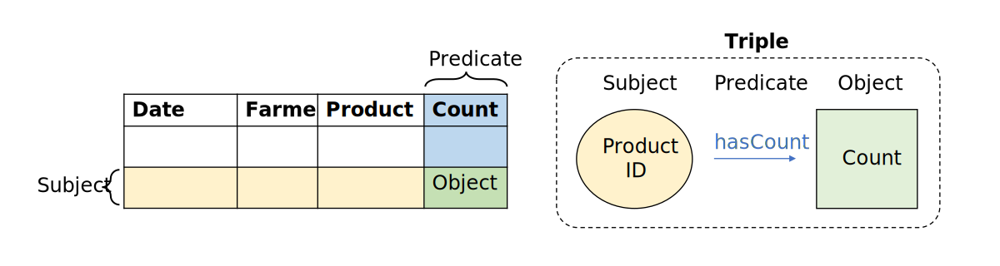

# 1 Write a simple TARQL query :tomato:    

Let's start with `farming.csv` from `./data/raw_data`. This dataset contains column names in the first row and has a relatively structured format (values in each column are atomic and of the same type with no missing values).  

The dataset, however, does not contain a primary key for tracking different vegetable product counts.          

| Date | Farmer | Product | Count |
| -----|--------|---------|-------|
| 4/09/2021 | Bolger | pumpkin | 29 |
| 4/09/2021	| Bolger | tomato | 62 |

Since we are interested in constructing a food supply chain, we might be interested in incoporating data relationships where:  

+ We focus on the product as a subject i.e. who was it produced by, when and where was it produced and in how many units.
+ We would like to link the farmer back to a farm or company and indicate whether this is a local or overseas product.   


## 1.1 Create a simple Resource Description Framework (RDF)    

First of all, let's explore how we can transform CSV files into RDF files in preparation for SPAQRL querying. A RDF contains the following interesting properties:  

**Internationalized Resource Identifiers (IRIs)**  
+ An IRI is designed to reference a universally consistent naming convention, so that all nodes and edges are described in an unambiguous way. 
+ An IRI can be a unique URL describing each subject  value i.e.`http://hobbiton.com/schema/Frodo` or a unique project-value tag i.e. `urn:isbn:12345X`. IRIs are also referred to as Universal Resource Identifiers (URIs), although URIs are actually a subset of IRIs.       
+ The IRI naming convention is declared via the `PREFIX` section at the start of our TARQL script. For example, we use `PREFIX xsd:` from the [XML schema](https://www.w3.org/TR/rdf11-concepts/#xsd-datatypes) to denote data type.     
+ A script can reference multiple IRIs i.e. multiple naming conventions (see example below). 
+ In `farming.csv`, we would need to generate IRIs for at least products and farmers via the TARQL functions `UUID()` or `IRI()`, similar to the concept of generating a primary key in a relational database.   

```
# A user-defined default namespace for the majority of nodes and the edges in the graph
PREFIX ex: <http://hobbiton.com/schema/> 

# A built-in RDF namespace for describing instances of a class i.e. rdf:type 
PREFIX rdf: <http://www.w3.org/1999/02/22-rdf-syntax-ns#>

# A built-in RDF namespace for describing classes i.e. rdfs:subClassOf 
PREFIX rdfs:<https://www.w3.org/2000/01/rdf-schema#>

# The RDF namespace for describing data types is based on the XML Schema i.e. xsd:integer() 
PREFIX xsd: <http://www.w3.org/2001/XMLSchema#>
```

**Subject-predicate-object triples**  


+ RDFs are stored in the form of `?subject ?predicate ?object` triples, as represented above.  
+ Subjects and predicates must exist as IRIs. This is why column names, which are predicates, must always reference a PREFIX in TARQL.   
+ Objects can exist as an IRI, string or other data type i.e. date, integer, BigDecimal or boolean data type. TARQL treats all values as strings by default. To access special arithmetic, boolean or date operations, we cast strings using `BIND(xsd:type(column_name) AS ?new_name)`.    

## Exercise 1.1  

We can convert `farming.csv` into a simple RDF with:  
1. `Product` values assigned an IRI.       
2. `Count` converted into an integer type and `Date` converted into a date type.  

The script execution sequence should be read in the order of `FROM <...> WHERE {...} CONSTRUCT {...}`.   

```
PREFIX ex: <http://www.hobbiton.com/schema>
PREFIX xsd: <http://www.w3.org/2001/XMLSchema#>

CONSTRUCT {
  ?product_iri ex:product ?Product ; 
  ex:farmer ?Farmer ;
  ex:date ?date ;
  ex:count ?count . 
}
FROM <file:farming.csv>
WHERE { 
  BIND(REPLACE(STR(?Product),"[ ]","_") AS ?product)
  BIND (IRI(CONCAT('http://www.hobbiton.com/schema/product#', ?product)) AS ?product_iri) 
  BIND (xsd:integer(?Count) AS ?count)
  BIND (xsd:dateTime(?Date) AS ?date)
} 
```

To convert `farming.csv` into an RDF, we need to use the command line to navigate to `.\scripts` and run the TARQL script using the following code below. The use of `>` enables us to save the output rdf as `farming_unstructured.rdf` in `.\data\clean_data\`.  

```
tarql --write-base convert_farming_csv_unstructured.rq ..\data\raw_data\farming.csv > ..\data\clean_data\farming_unstructured.rdf
```

>**Note**
> The output option `--write-base` needs to be used to convert CSV files into Turtle RDFs i.e. the most commonly used RDF serialisation format.    

## 1.2 Create a structured RDF data model  


# Resources 
+ Chapter 2 of [Learning SPAQRL Version 2](http://www.learningsparql.com/) by Bob DuCharme.  
+ [Stardog tutorial](https://docs.stardog.com/tutorials/rdf-graph-data-model#rdf-schema) describing the properties of an RDF schema.  
+ [LinkedIn post](https://www.linkedin.com/pulse/using-tarql-convert-excel-spreadsheets-rdf-kurt-cagle/) on installing and using the `tarql` package.    
+ Blog posts [here](https://www.bobdc.com/blog/tarql/) and [here](https://www.semanticarts.com/how-to-sparql-with-tarql/) on converting `csv` files to `rdf` files using the `tarql` package.